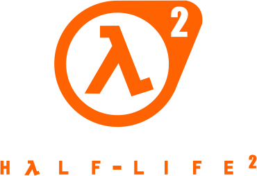

<div align=center>



</div>
<h1 align=center>Half-Life 2 - Nintendo Switch port</h1>

This is a wrapper/port of the Android version of Half-Life 2 (v1.16.29 - 1.17.0025, nillerusr Source engine port). <br/>
It loads the original game's ARM64 libraries, and runs them as-is in a minimalist fake-Android environment.

### How to install

You're going to need:
* the Source Engine `.apk` [HERE](https://arumoon.github.io/source-engine-download/) and Half-Life 2 Files (from a legally 
 obtained copy of the game)

To install, create `/switch/hl2_nx/` on your SD card and lay it out like this:

```
/switch/hl2_nx/
  hl2_nx.nro
  lib/                  <- all 27 .so files from the APK's lib/arm64-v8a/
  lib/episodic/         <- EP1/EP2 libclient.so and libserver.so from the episodic APK
  assets/extras_dir.vpk <- from the APK's assets/
  files/                <- the fonts from the APK's assets/ (dejavusans.ttf,
                           dejavusans-bold.ttf, DroidSansFallback.ttf,
                           LiberationMono-Regular.ttf, Itim-Regular.otf)
  hl2/                  <- from the game data (the big one: hl2_pak, textures, sounds, maps...)
  episodic/             <- episode 1 (Optional)
  ep2/                  <- episode 2 (Optional)
  platform/             <- from the game data
```

Episode One / Two need episodic `libclient.so` and `libserver.so` in `lib/episodic/` from [HERE](https://nc.workbench.network/s/gdRnpcc2zrXz5Xg/download?path=%2F&files=episodic-1.06_96.apk).

### Notes

This will not work in applet/album mode — use a game override (hold R on a title) or a forwarder.
The Switch needs the full application memory pool

A `config.txt` is created next to the nro on first run:
* `screen_width` / `screen_height` — passed as `-w`/`-h` when both set; `-1` lets the engine pick
* `gamedir` — game to launch: `hl2` (default), `episodic` (Episode One), or `ep2` (Episode Two)
* `args` — extra Source command line
* `lang` — Source language name (default `english`)


### How to build

You need devkitA64 plus the following pacman packages:
* `switch-sdl2`
* `switch-sdl2_image`
* `switch-mesa`
* `switch-libdrm_nouveau`
* `switch-zlib`
* `switch-ffmpeg`

### Credits

* nillerusr for the Android Source engine port this wraps
* TheOfficialFloW & fgsfds for the so-loader lineage
* Masagrator for the hl2_picker

### Support

If you enjoy my work and want to support me :

[](https://ko-fi.com/D1D1P2MOG)

### Legal

This project has no affiliation with Valve Corporation. "Half-Life" and "Source" are trademarks
of their respective owners. All Rights Reserved.

No assets or program code from the original game or its Android port are included in this project.
We do not condone piracy in any way, shape or form and encourage users to legally own the original
game.

Unless specified otherwise, the source code provided in this repository is licensed under the MIT
License. Please see the accompanying LICENSE file.
